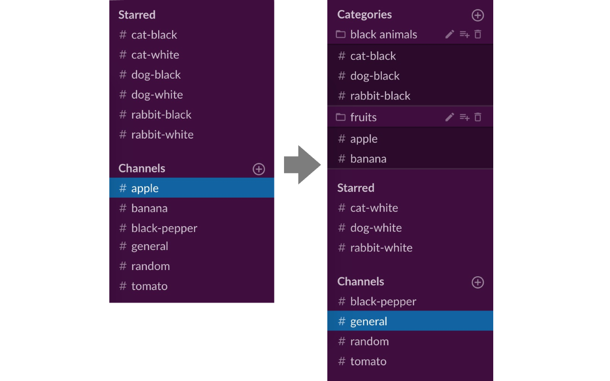

# slack-channel-categorize
Chrome Extension for categorizing your Slack channels



Chrome Web Store: [Slack Channel Category](https://chrome.google.com/webstore/detail/slack-channel-categorize/djlkdalfneeoooaehkajnofonbnjfmph)

## development

- Node.js v12.1.0

### setup
```
npm install
```

### build
```
export PATH=$PATH:./node_modules/.bin
webpack
```

